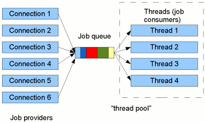

class: inverse, center, middle

# Reactive Spring

---

# Reaktív Kiáltvány 

* [The Reactive Manifesto](https://www.reactivemanifesto.org/)
  * Reszponzivitás (Responsive): az alkalmazásnak minden esetben gyors választ kell adnia
  * Ellenállóképesség (Resilient): az alkalmazásnak reszponzívaknak kell maradnia hiba esetén is
  * Elaszticitás (Elastic): reszponzivitás nagy terhelés esetén is
  * Üzenetvezéreltség (Message-driven): rendszerek elemei aszinkron, nem blokkoló módon, üzenetekkel kommunikálnak

---

# Akadályozó tényezők: <br /> Szinkron IO

* CPU arra vár, hogy beérkezzen az adat (pl. teljes http request, adatbázis result set)
* A megoldás létezik Java 1.4 óta: Java NIO (New IO), másnéven Non-blocking IO
* Operációs rendszer lehetőségeit használja ki (Linux, Windows)
* Nem várja meg az olvasás eredményét, hanem egy callback, mely visszahívásra kerül, ha előállt az adat
* CPU-t szabadít fel
* `java.nio.Buffer`, pl. `ByteBuffer` - olyan pufferterület, mely konkrétan az operációs rendszerhez kötött,
  így pl. fájl olvasáskor nem kell az operációs rendszer memóriájából a JVM memóriájába átmásolni, így CPU-t takarít meg
* `java.nio.channels.Channel`, pl. `AsynchronousFileChannel` - `Buffer` írás és olvasás, tipikusan fájl és socket felé vagy felől

---

# AsynchronousFileChannel

```java
public abstract Future<Integer> read​(ByteBuffer dst,
                                     long position)

public abstract <A> void read​(ByteBuffer dst,
                              long position,
                              A attachment,
                              CompletionHandler<Integer,? super A> handler)
```

Az `Attachment` a context tárolására való, ez köthető az aktuális olvasáshoz,
ebben lehet információt átadni a `CompletionHandler` példánynak 

---

# NIO státusza

* Különösen hatékony, ha pl. fájlt kell kiszolgálni http-n, hiszen nem kell a JVM memóriába beolvasni
* Nem használjuk, túl alacsony szintű
* Kevés eszköz támogatja
* Bizonyos eszközök támogatják, pl. a Netty (NIO client server framework, hálózati alkalmazások fejlesztésére)
  * Szakít a klasszikus szinkron Servlet API hagyományokkal

---

# Akadályozó tényezők

* A reaktív kiáltvány betartásának számos akadályozó tényezője van

---

# Akadályozó tényezők: <br /> Szálkezelés

* IO-ra várás blokkolja a szálakat
* Skálázás
  * Futtatás több szálon
  * Horizontális skálázás
* Problémák
  * 1 MB stack/thread (1000 szál esetén?)
  * Context switch, hiszen nincs annyi magos processzorunk

---

# Akadályozó tényezők: <br /> Kollekciók

* Magas absztrakciós szinten gondolkozunk, tipikusan entitások kollekciói
* Kollekciók esetén be kell gyűjteni az összes elemet
* Az `Iterator` és a `Stream` már jó előrelépés, azonban a _pull_-központúak

---

# Akadályozó tényezők: <br /> Push túlterhelés

* Amennyiben a termelő a saját ütemében állítja elő az adatot,
túlterhelheti a fogyasztót
* Ez hálózati protokolloknál ismert jelenség, megoldása a flow control, vagy push back
* Több mechanizmus is van (lásd [Wikipedia](https://en.wikipedia.org/wiki/Flow_control_(data))

---

# Akadályozó tényezők: <br /> Keretrendszer támogatás

* Hiánya
* Pl. Spring, Hibernate

---

# Reaktív manifesztó következményei

* Programozási paradigma, ahol a rendszer az adatelemek folyamára reagál
* Back pressure: reaktív nevezéktanban mechanizmus arra, hogy a termelő ne árassza el a fogyasztót
* Non-blocking back pressure: fogyasztó kéri a következő x elemet, amit fel tud dolgozni

---

# Reaktív megvalósítások <br /> Javaban

* Eclipse Vert.x
* Akka
* RxJava
* Project Reactor

---

# Kitekintés: mobil fejlesztés

* Android környezetben az RxJava elterjedt
* Szálkezelés megvalósításának egyszerűsítésére
    * Szálkezelés: felhasználói interakció, hálózat, GPS, stb.
* Callback hell ellenszere
* Legjobb gyakorlatok (pl. a felhasználó közbülső interakcióját nem kell figyelembe venni 
	- karakterenkénti szűrés, keresés - Throttling)
* Integráció a Retrofit REST kliens library-vel

---

# Kitekintés: <br /> Retrofit + RxJava

```java
Observable<String> getTopContributors(String userName) {
        return gitHubApi.listRepos(userName)
          .flatMapIterable(x -> x)
          .flatMap(repo -> gitHubApi.listRepoContributors(userName, repo.getName()))
          .flatMapIterable(x -> x)
          .filter(c -> c.getContributions() > 100)
          .sorted((a, b) -> b.getContributions() - a.getContributions())
          .map(Contributor::getName)
          .distinct();
    }
```

---

# Reaktív megoldások együttműködésére

* [Reactive Streams specifikáció](https://www.reactive-streams.org/)

---

# Java 9 Flow API


---

# Funkcionális Reaktív Programozás

* Funkcionális stílusban kivitelezett reaktív programozás
* Alapja a mellékhatás és állapot nélküli függvények
* Deklaratív
* Sok boilerplate kód eliminálása
* Hibakezelés nem külön ágon
* Könnyebb karbantarthatóság, jobb kódminőség
* Defacto standard megoldások
* Callback-hell ellen
* Pipeline or stream of data flow
* Újrafelhasználható operátorok

---

# Project Reactor

* Reactive Streamsre épülő reactive library
* Java `CompetableFuture`, `Stream` és `Duration` támogatás
* Spring közeli
* Teljes ecosystem, nem kell magunk implementálni:
  * Reactor Netty: HTTP, TCP, UDP kliens/szerver, Netty-re építve
  * Reactor Kafka: Kafka integráció
  * Reactor RabbitMQ: RabbitMQ integráció
* Típusos adatfolyamok (`Publisher`):
  * `Mono<T>`: nulla vagy egy elem
  * `Flux<T>`: n elem

---

# Java 8 Stream API

```java
@Test
void operationsWithStream() {
    var names = List.of( new Employee("John Doe", 1970),
            new Employee("Jack Doe", 1980),
            new Employee("Jane Doe", 1990))
            .stream()
            .filter(e -> e.getYearOfBirth() <= 1980)
            .map(Employee::getName)
            .sorted()
            .skip(1)
    .collect(Collectors.toList());

    assertEquals(List.of("John Doe"), names);
}
```
---

# Project Reactor

```java
@Test
void operationsWithReactor() {
    var employees = Flux.just(
            new Employee("John Doe", 1970),
            new Employee("Jack Doe", 1980),
            new Employee("Jane Doe", 1990)
            );
    var names = employees
            .filter(e -> e.getYearOfBirth() <= 1980)
            .map(Employee::getName)
            .sort()
            .skip(1);

    StepVerifier.create(names)
            .expectNext("John Doe")
            .verifyComplete();

}
```

---

# Operátorok


[API dokumentáció](https://projectreactor.io/docs/core/release/api/)

---

# Marble diagram


---

# Klasszikus Servlet API



---

# Spring WebFlux

* Spring MVC alternatíva
* Spring MVC tapasztalataira építve
* Hasonló megközelítés, egymás mellett élő, független implementációk
* Reactive HTTP API-ra építve (Servlet API helyett)
* Default web konténer: Netty
* Router functions
* WebClient: non-blocking, reactive HTTP kliens
* Jól használható Websocket és SSE esetén

---

# Spring WebFlux


---

# Controller

```java
@RestController
@RequestMapping("/api/employees")
public class EmployeeController {

    private EmployeeService employeeService;

    @GetMapping
    public Flux<EmployeeDto> listEmployees() {
        return employeeService.listEmployees();
    }

    @PostMapping
    public Mono<EmployeeDto> createEmployee(@RequestBody Mono<CreateEmployeeCommand> command) {
        return employeeService.createEmployee(command);
    }
}
```

---

# RouterFunction

```java
@Configuration
public class CityController {

    private CityService cityService;

    @Bean
    public RouterFunction<ServerResponse> route() {
        return RouterFunctions
                .route(RequestPredicates.GET("/api/cities/{name}"), this::findByName);
    }

    public Mono<ServerResponse> findByName(ServerRequest request) {
        return ServerResponse
                .ok()
                .body(cityService.findByName(request.pathVariable("name")), City.class);
    }

}
```

---

# Dao réteg - MongoDB

```java
public interface EmployeeRepository extends ReactiveCrudRepository<Employee, String> {

}
```

---

# Service réteg

```java
@Service
public class EmployeeService {

    private EmployeeRepository employeeRepository;

    public Mono<EmployeeDto> createEmployee(Mono<CreateEmployeeCommand> command) {
        return command
                .map(this::toEmployee)
                .flatMap(employeeRepository::save)
                .map(this::toEmployeeDto);
    }

    public Flux<EmployeeDto> listEmployees() {
        return employeeRepository
                .findAll()
                .map(this::toEmployeeDto);
    }

}
```

---

# Klasszikus RDBMS réteg

* JDBC
* Szinkron, blokkoló

---

# Reactive RDBMS

* R2DBC nyílt specifikáció
* Project Reactor és RxJava támogatás
* Implementációk: H2, MySQL/MariaDB, Oracle, Microsoft SQL Server
* Klasszikus funkciók: tranzakciókezelés, batch, LOB, unchecked és típusos kivételek
* Tudja használni pl. a Spring Data R2DBC vagy JOOQ

```java
ConnectionFactory connectionFactory = ConnectionFactories
  .get("r2dbc:h2:mem:///testdb");

Mono.from(connectionFactory.create())
  .flatMapMany(connection -> connection
    .createStatement("SELECT firstname FROM PERSON WHERE age > $1")
    .bind("$1", 42)
    .execute())
  .flatMap(result -> result
    .map((row, rowMetadata) -> row.get("firstname", String.class)))
  .doOnNext(System.out::println)
  .subscribe();
```
---

#  Spring Data R2DBC <br /> Repository

Repo:

```java
public interface CityRepository extends ReactiveCrudRepository<City, Long> {

}
```

Service:

```java
public Mono<City> findByName(String name) {
  return cityRepository.findByName(name);
}
```

---

# Tranzakciókezelés

* `inTransaction(...)` metódusok
* Ha mégis a klasszikus utat választanánk
* Imperatív megoldás a `ThreadLocal`-hoz köti
* `ReactiveTransactionManager`
* Itt is támogatott a deklaratív és programozott
* Deklaratív: `@Transactional` annotáció
* Programozott: `TransactionalOperator`

[Reactive Transactions with Spring](https://spring.io/blog/2019/05/16/reactive-transactions-with-spring)

---

# TransactionalOperator <br /> példa

```java
TransactionalOperator rxtx = TransactionalOperator.create(tm);

Mono<Void> atomicOperation = db.execute()
  .sql("INSERT INTO person (name, age) VALUES('joe', 'Joe')")
  .fetch().rowsUpdated()
  .then(db.execute()
    .sql("INSERT INTO contacts (name) VALUES('Joe')")
    .then())
  .as(rxtx::transactional);
```

---

# Klasszikus integráció

* Szinkron blokkoló HTTP protokoll

---

# Reactive WebClient

```java
private Mono<String> findTemperature(String name) {
    return WebClient.create("https://www.idokep.hu/idojaras/".concat(name))
            .get()
            .retrieve()
            .bodyToMono(String.class)
            .flatMapMany(s -> Flux.fromStream(new Scanner(s).findAll("\"homerseklet\">([^<]*)<")))
            .map(m -> m.group(1))
            .next();
}
```

---

# RSocket

* Reactive Streams semantics between client-server, and server-server communication
* Binary protocol for use on byte stream transports such as TCP, WebSockets (reactor-netty), akka, Aeron (UDP)
* Különböző kommunikációs modellek [Introduction to RSocket](https://www.baeldung.com/rsocket)
  * Request/Response
  * Fire-and-Forget
  * Request/Stream (egy kérés, több válasz)
  * Channel (kétirányú adatfolyam)
* Java, Kotlin, JavaScript, Go, .NET, C++
* Natív Spring támogatás
* Spring server: [Getting Started With RSocket: Spring Boot Server](https://spring.io/blog/2020/03/02/getting-started-with-rsocket-spring-boot-server)
* Spring client: [Getting Started With RSocket: Spring Boot Client](https://spring.io/blog/2020/03/09/getting-started-with-rsocket-spring-boot-client)

---

# Ajánlott irodalom

* Craig Walls: Spring in Action (5. edition)
* Josh Long: Reactive Spring
* [GOTO 2019 • Reactive Spring • Josh Long](https://www.youtube.com/watch?v=1F10gr2pbvQ)